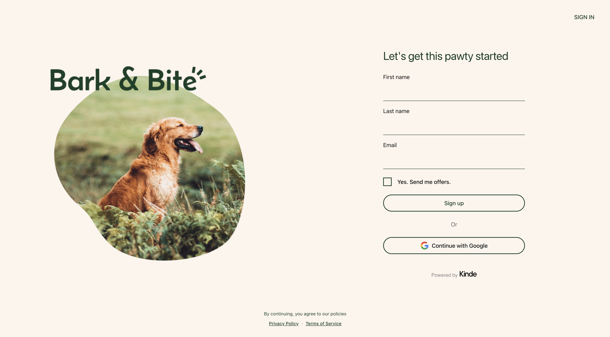

# 🐾 Bark & Bite - Kinde Custom UI Starter (Redirect Unknown Email to Sign Up)

A fully customizable UI starter template built with React Server Components and Kinde's Custom UI feature. Design your auth flows with complete control over the UI, including automatic redirect to sign-up when a login email is not found and seamless email prefill on the register form.

This repository is purpose-built for the unknown-email login recovery flow (redirect to sign-up with prefill) and is not intended to be a general Kinde Custom UI reference.

## Preview

View [live demo](https://barknbite.kindedemo.com/auth/cx/_:nav&m:register&psid:0194dd77a537034284e1e6d54a3f5777)



## Features

- 🎯 Full control over auth UI design and layout
- 🚀 Built with React Server Components
- 🔒 Kinde Authentication integration
- 📱 Responsive design out of the box
- 🔄 Redirect users to sign-up when login email is unknown
- ✍️ Prefill register email after redirect for a smoother recovery flow

## Prerequisites

- npm or yarn
- A Kinde account with Custom UI feature enabled

## Quick Start

In your project root directory, use the Kinde CLI and run

```bash
kinde custom-ui --template bark-n-bite
```

## Looking for general Custom UI guides/templates?

This repository is intentionally focused on the unknown-email login recovery flow.

For broader Kinde Custom UI guidance and starter templates, see:

- [Kinde docs](https://docs.kinde.com)
- [Kinde starter kits organization](https://github.com/kinde-starter-kits)
- [Kinde community](https://community.kinde.com)

## Customization Guide

### Page Layouts

The template includes customizable layouts for all authentication pages:

- Sign In
- Sign Up
- Password Reset
- Email Verification
- Multi-factor Authentication
- Social Authentication
- Error Pages
- And more...

Each layout can be customized in the `kindeSrc/environment/pages/(kinde)` directory.

## How it works: redirect to sign-up on unknown email

When a user tries to sign in with an email that has no Kinde account, this template automatically redirects them to the sign-up page with their email pre-filled instead of leaving them on the "No account found with this email" error.

The flow spans two custom-UI pages.

### On the login page (`kindeSrc/environment/pages/(kinde)/(login)/page.tsx`)

1. An injected client script caches whatever the user types into the email/username input, using event delegation on `document` so it survives Kinde re-rendering the form.
2. A `MutationObserver` on `document.body` watches for Kinde's validation error element to appear. It matches either of the two field ids Kinde uses depending on the configured auth identifier:
   - `sign_up_sign_in_credentials_p_email_username_error_msg` (email-or-username mode)
   - `sign_up_sign_in_credentials_p_email_error_msg` (email-only mode)
3. When the error text matches the configured pattern (case-insensitive; default covers both `"No account found with this email"` and `"Sorry, we don't recognise that email address or username."`), the script writes the cached email to `sessionStorage` under `kinde_prefill_email` and navigates to `getKindeRegisterUrl()`.

### On the register page (`kindeSrc/environment/pages/(kinde)/(register)/page.tsx`)

1. On load, a client script reads `sessionStorage["kinde_prefill_email"]`.
2. If present, it writes the value into the register form's email input using the native `HTMLInputElement.prototype` value setter (so React's synthetic-event tracker picks up the change) and dispatches `input` plus `change` events.
3. A `MutationObserver` retries the fill until the input mounts (Kinde widgets load async), with a 10-second safety timeout.
4. The storage entry is cleared after fill so a direct visit to `/register` later does not auto-fill with a stale value.

### Why `sessionStorage` instead of `login_hint` on the URL?

Kinde's custom-UI URLs (for example `/auth/cx/_:nav&m:register&psid:...`) are not standard query-string routes, and the register widget does not currently honor OIDC `login_hint` as a prefill source. `sessionStorage` is same-origin and survives the redirect, which makes it the reliable handoff mechanism. The login page still appends `?login_hint=` to the URL as a no-op fallback in case future Kinde releases do honor it.

### Tuning

- The error-text trigger is controlled by `NO_ACCOUNT_ERROR_TEXT_PATTERN` in the login page. It is a regex source string (compiled with the `i` flag) and uses `|` alternation to match multiple known phrasings. Add new variants if your Kinde account customizes the error copy.
- If the `EMAIL_STORAGE_KEY` constant is renamed, update both `(login)/page.tsx` and `(register)/page.tsx`. They must match.

## Project Structure

```
📂 splitScape
├── 📂 kindeSrc
│   └── 📂 environment
│       └── 📂 pages
│           └── 📂 (kinde)
│               ├── 📂 (default)
│               │   └── ⚛️ page.tsx
│               ├── 📂 (login)
│               │   └── ⚛️ page.tsx
│               └── 📂 (register)
│                   └── ⚛️ page.tsx
└── 📄 kinde.json

```

## Contributing

We welcome contributions. Please feel free to submit a Pull Request.

1. Fork the project
2. Create your feature branch (`git checkout -b feature/AmazingFeature`)
3. Commit your changes (`git commit -m 'Add some AmazingFeature'`)
4. Push to the branch (`git push origin feature/AmazingFeature`)
5. Open a Pull Request

## License

This project is licensed under the MIT License. See the [LICENSE](LICENSE) file for details.

## Support

Need help? Here are some resources:

- Check out the [video demos](https://www.loom.com/share/folder/4398af02bbde4f498952ab4654a331a3) for implementation examples
- Join the [Kinde Community](https://community.kinde.com)
- Open an issue on GitHub
- Review the [Kinde documentation](https://docs.kinde.com)
